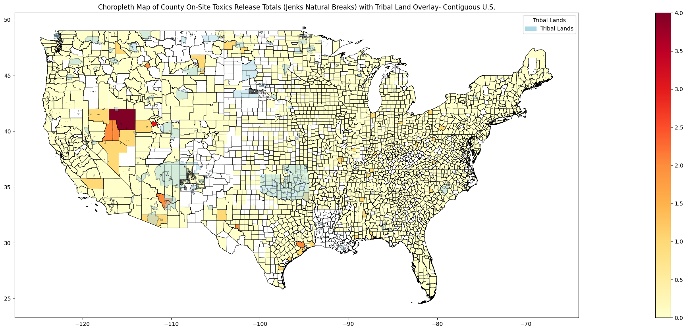
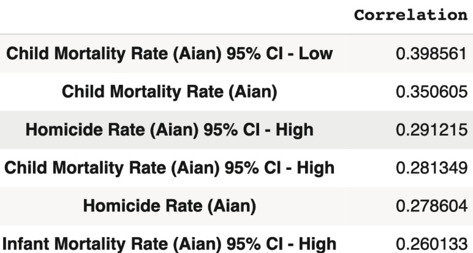
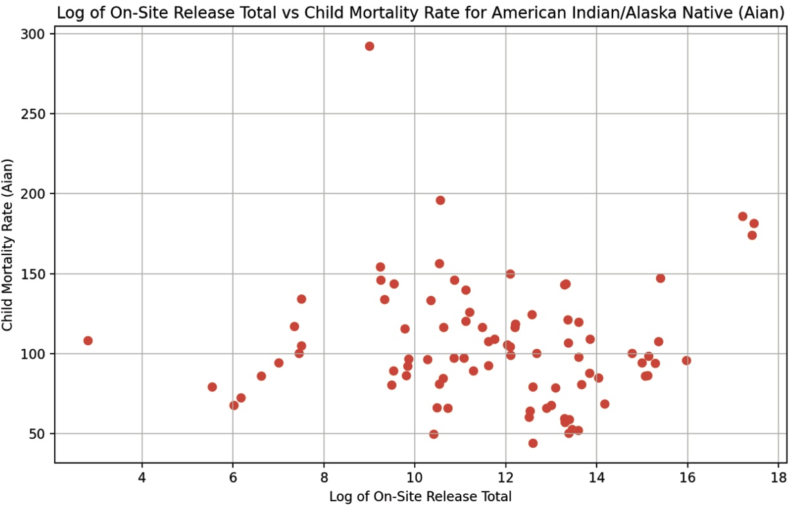

# Toxics Release and Health Disparities: Mapping America

 This project explores the correlation between toxic chemical releases and health disparities in the United States. By analyzing county-level data, it finds a weak correlation between on-site toxics release totals and child mortality outcomes for American Indian/Alaska Native populations.

## Background
Toxic chemical releases threaten environmental and public health worldwide. Exposure to toxic air, water, soil, and chemical pollution is the largest environmental cause of premature death (Global Alliance on Health and Pollution). This project focuses on the United States, exploring county health outcomes correlated with the release of toxics, as well as the possibility of using health data and machine learning to predict which counties have released the most total toxics.

## Data Collection
The EPA’s Toxics Release Inventory data and Social Explorer’s Health Data (from County Health Rankings and Roadmaps of the University of Wisconsin Population Health Institute) were merged using year (2020-2022) and cleaned county labels.

https://www.epa.gov/toxics-release-inventory-tri-program/tri-basic-data-files-calendar-years-1987-present
https://www.epa.gov/system/files/documents/2022-10/TRI_Basic_Data_File_Documentation_RY2021_102522.pdf
https://www.socialexplorer.com/product-maps/us_health_data

## Machine Learning
**Target:** Binary variable indicating whether a county was in the top 25% of counties for on-site toxics release totals in 2022.
**Features:** All quantitative and categorical health metric columns from the 2022 Health Data. Preprocessing: All quantitative features are standardized and all categorical features are one- hot encoded.
**Train/Test Split:** 70% of counties in 2022 were randomly assigned to training and 30% to testing.
**Model:** Histogram-based Gradient Boosting Classification Tree. This ensemble technique works fast for big datasets and natively supports NaN
values, using histograms to partition the feature space and build an ensemble of decision trees through sequential training and gradient optimization.
*From scikit-learn.org:* “During training, the tree grower learns at each split point whether samples with missing values should go to the left or right child, based on the potential gain. When predicting, samples with missing values are assigned to the left or right child consequently. If no missing values were encountered for a given feature during training, then samples with missing values are mapped to whichever child has the most samples.”

## Correlation Analysis

The correlations between each quantitative column of health data from the merged and cleaned data frame and the column corresponding to total quantities of toxic chemicals released to air, water and land on-site at industrial facilities were calculated. Every metric with a correlation greater than 0.25 is displayed, alongside the correlation, above. There is a weak correlation on a county level between on-site release totals and child mortality rate for American Indian/Alaska Native (Aian), homicide rate for Aian, and infant mortality rate for Aian.

## Data Analysis
Analysis of toxics release and health data using correlation, choropleth mapping, and machine learning led to several takeaways:
- There is a weak correlation on a county level between on-site toxics release totals at industrial facilities and child mortality, homicide, and infant mortality rates for American Indian/Alaska Native (Aian) populations.
- Using Social Explorer’s 2022 Health Data, a histogram-based gradient boosting classifier predicted with > 99% accuracy whether American counties were in the 75th percentile of counties in terms of their on-site toxics release totals.
- Among the counties with the highest z-scores for on-site toxics release totals, many also contained tribal lands.
